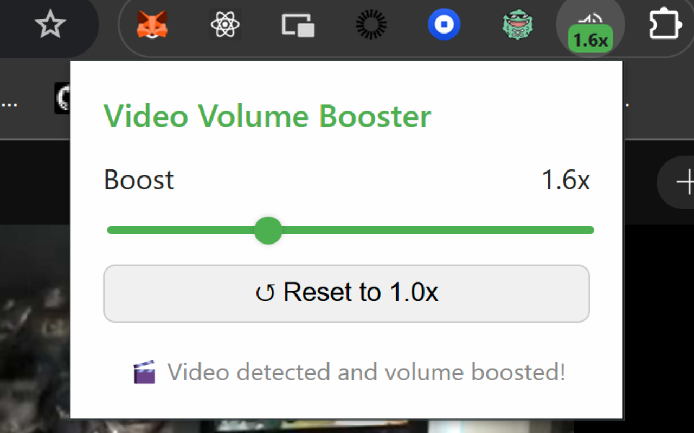

# 📢 Safest Volume Booster Chrome Extension

**Safest Volume Booster** is a lightweight Chrome extension that allows you to **boost the volume of HTML5 video elements beyond the default 100%**, using the Web Audio API.

Most importantly, this has **as little permissions as possible**.

## 🛡️ Chrome App Store

[Here!](https://chromewebstore.google.com/detail/safest-volume-booster/bahmikgppbhgdmadeafdmnjllhinkdcb?hl=en-US)

## Why I Made This

I had a volume booster extention for years via the Chrome App Store. There is a large issue with extentions getting hijacked and malicious code being uploaded. Due to extentions auto-updating, a malicious actor uploaded an update to it and got access to all my sessions. **My bank session, my work sessions, etc.**

## ✅ Why This Extension Is Safe

This extension uses **minimal, privacy-friendly permissions**:

| Permission   | Purpose                                      |
|--------------|----------------------------------------------|
| `activeTab`  | Only runs on the currently open tab when you interact with it |
| `scripting`  | Injects volume boost logic — only on demand  |
| `storage` (optional) | Stores your preferred volume boost level locally |

### 🚫 No access to:
- Background scripts that run silently
- All URLs or tabs in your browser
- Any cookies, sessions, or page content unless you activate it

## ⚠️ Dangerous Chrome Extension Permissions

| Permission         | Can Steal Tokens | Can Redirect URLs | Abuse Potential                                                                 |
|--------------------|------------------|--------------------|----------------------------------------------------------------------------------|
| `"<all_urls>"`     | ✅ Yes            | ✅ Yes              | Full access to every page the user visits — steal tokens, inject JS, spy silently |
| `webRequest*`      | ✅ Yes            | ✅ Yes              | Monitor, block, or rewrite network requests — can hijack sessions or inject payloads |
| `tabs`             | ❌ No*            | ✅ Yes              | Redirect or open tabs to phishing or ad pages                                     |
| `cookies`          | ✅ Yes            | ❌ No               | Read session cookies if also granted host access                                 |
| `scripting` + `"<all_urls>"` | ✅ Yes   | ✅ Yes              | Run arbitrary JavaScript on any site, intercept form data, keystrokes, etc.       |
| `activeTab`        | ❌ No             | ❌ No               | Only affects the currently active tab when the user interacts                     |
| `storage`          | ❌ No             | ❌ No               | Can only store internal extension data, not page data                             |

> 💡 Extensions that request broad access (especially `"<all_urls>"`, `webRequest`, or `cookies`) can potentially hijack sessions, inject malicious scripts, or spy on sensitive data.

## Why you have to click the extention for it to apply

I didn't want to run anything in the background. It only has the ability to run any code when it is clicked on.

## 📁 Installation (for Developers)

1. Clone or download this repo
2. Go to `chrome://extensions`
3. Enable **Developer Mode**
4. Click **“Load Unpacked”** and select the project folder
5. Use the popup to boost video volume!

---

## 👀 Notes

- Works on most video players using `<video>` tags
- Some sites (like Netflix or YouTube) may restrict audio routing due to strict CSP (Content Security Policy)
- You may need to press **Play** once for the volume boost to take effect

